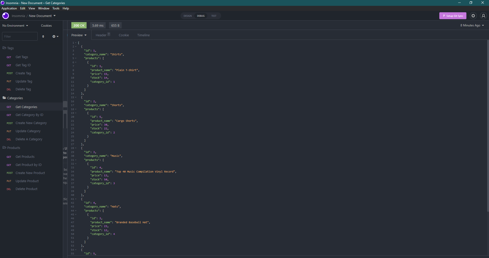

# E-commerce Back End Starter Code

## Table of Content

- [About The Project](#about-the-project)
- [Getting Started](#getting-started)
- [Usage](#usage)
- [Questions](#questions)
- [Author](#author)

(https://youtu.be/vh51BcyNi3k)

# About the Project

In this project I create a back-end coding system that can be used for ecommerce sites. Many major online stores make use of this type of system. The goal is to create an ecommerce system that is scalable and runs efficiently. To accomplish this I will use many different frameworks like MYSQL, Express, and Sequelize.

# Getting Started

Step 1) Install the programs

```
npm init
```

```
npm i mysql2 squelize dotenv nodemon
```

Step 2) In MYSQL run the following command

```
source db/schema.sql
```

Step 3) Now populate the database with seeds

```
npm run seed
```

Step 4) Run the program

```
npm run start
```

## Usage

The goal of this project is an ecommerce website that uses the back end to organize data and create a full stack.

This project is set up so that the developer does not have to worry about all of the backend code and simply focus on what they are best at - front-end coding in HTML, CSS, Javascript, and other languages.

## Questions

If you have any questions about the repo, open an issue or contact me directly at andrewbanagas40@gmail.com. You can find more of my work at [drew990](https://github.com/drew990/)

## Author

Andrew Banagas
